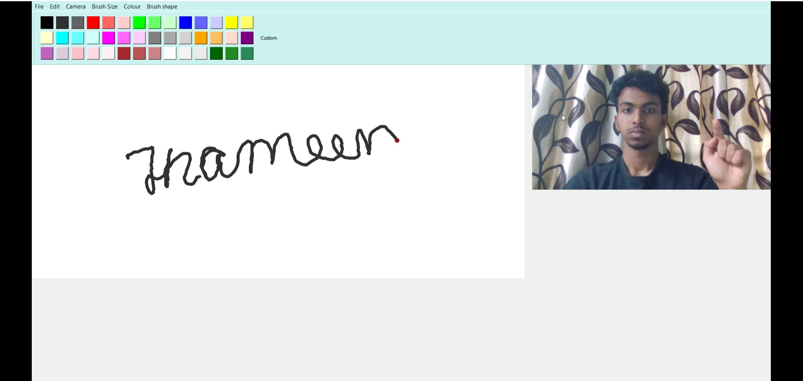
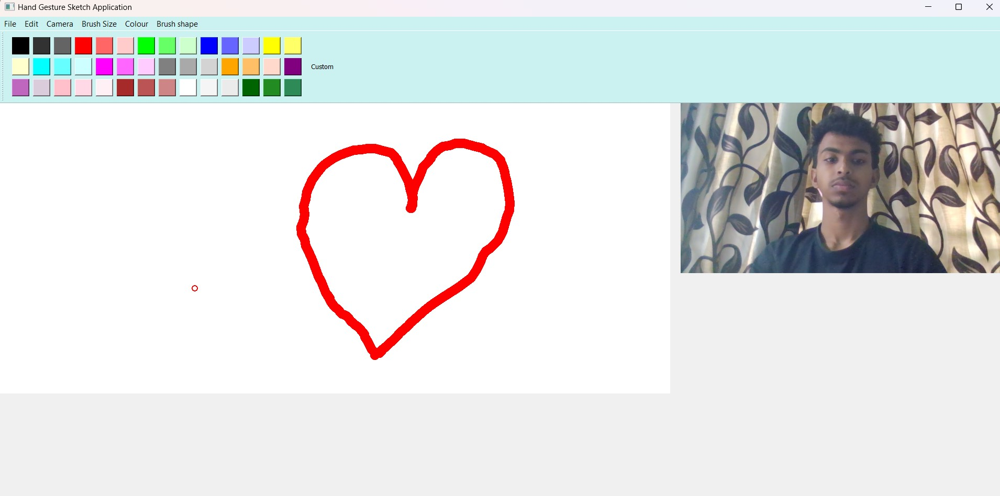

# 🖌️ GestureDraw AI - Virtual Drawing App with Hand Gestures

**GestureDraw AI** is a real-time, AI-powered virtual canvas that enables users to draw using just their hand gestures via webcam. It supports brush color/size customization, undo/redo, and the ability to save and resume artwork. Powered by **MediaPipe**, **OpenCV**, and **PyQt5**, this tool is ideal for intuitive, touch-free interaction.

---

## 📸 Screenshots

 

---

## 🚀 Features

- ✋ **Gesture-Based Drawing**
  - Detects hand gestures using MediaPipe
  - Index-thumb pinch gesture used to draw
  - Cursor mode for interaction; draw mode for sketching

- 🎨 **Dynamic Brush & Canvas**
  - Change brush **color** and **size** on the fly
  - Smooth stroke rendering with OpenCV

- 🔁 **Undo/Redo & Resume**
  - Undo or redo previous strokes
  - Resume and continue your previous drawing session

- 💾 **Export Work**
  - Save your artwork as `.jpg` images
  - Edit saved images seamlessly

---

## 🛠️ Tech Stack

| Component            | Technology          |
|---------------------|---------------------|
| Language            | Python 3.x          |
| Gesture Detection   | MediaPipe           |
| Drawing Engine      | OpenCV              |
| GUI Framework       | PyQt5               |
| Image Handling      | NumPy, OpenCV       |
| Undo/Redo Logic     | Python `deque`      |

---

## 🧑‍💻 How It Works

1. Launch the app – your webcam feed opens.
2. Perform the **pinch gesture** (index + thumb) to start drawing.
3. Use UI buttons to:
   - Switch between **Cursor/Draw Mode**
   - **Change color** or **adjust brush size**
   - Undo or redo strokes
   - Save your canvas or load previous work

---

## 📦 Installation

### Prerequisites
- Python 3.7 or later
- Webcam
- Basic GPU for real-time performance

### Install dependencies:
```bash
pip install opencv-python mediapipe pyqt5 numpy
